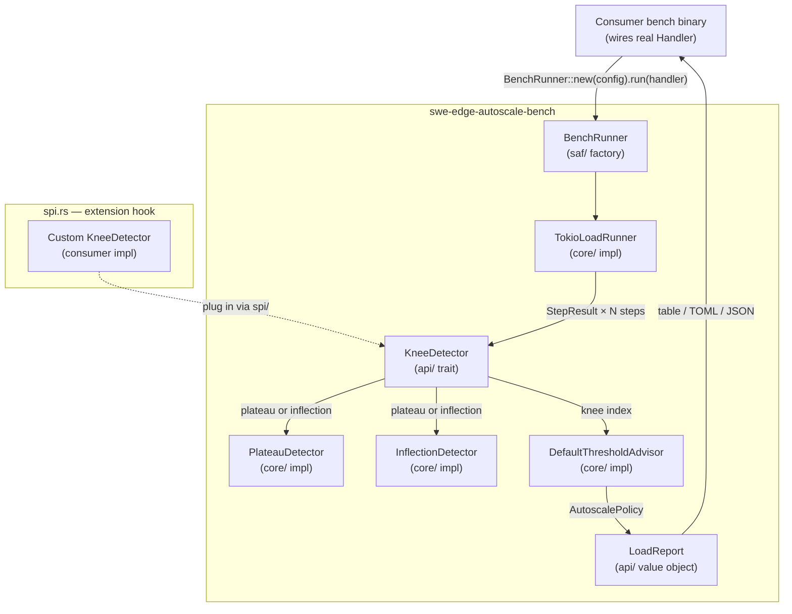
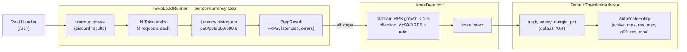
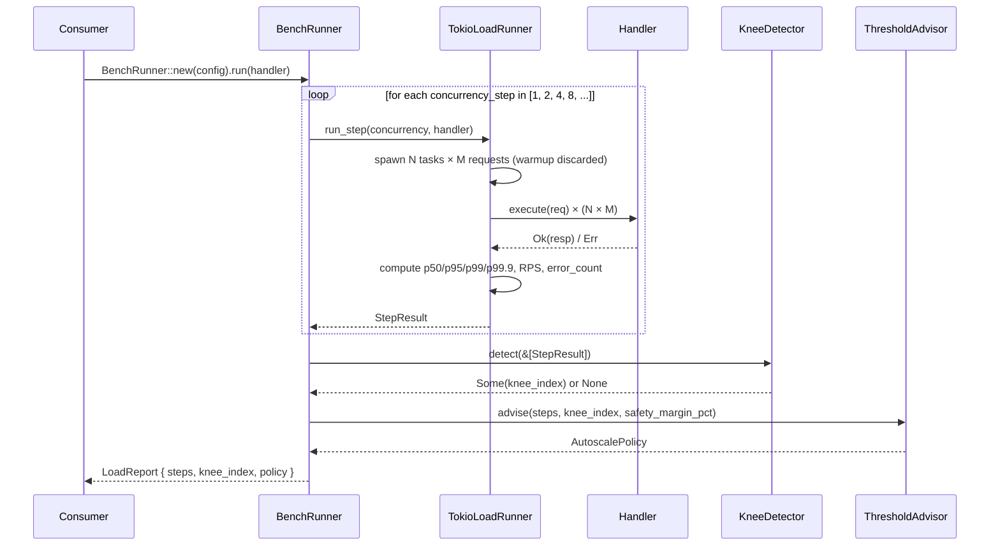

# Autoscale Architecture

**Audience**: Developers, architects, platform engineers

## Stakeholders & Concerns

> Per ISO/IEC/IEEE 42010:2022

| Stakeholder | Concerns |
|-------------|----------|
| Application developers | Simple API — wire real handler, get ready-to-paste TOML |
| Platform engineers | Empirical autoscale thresholds, no manual tuning, CI regression detection |
| Architects | SEA compliance, SPI extensibility, independence from ingress/egress transports |
| Operators | Deterministic output, JSON for CI artifacts, zero sidecar dependencies |

## TLDR

`autoscale/main/features/bench` is a library crate consumers embed in their own bench binary. It drives concurrency-stepped load against a real `Handler` implementation, detects the saturation knee using a configurable algorithm, applies a safety margin, and emits a ready-to-paste `[autoscale]` TOML block. Nothing is hardcoded — all thresholds, step shapes, and algorithms are TOML-configurable. Custom knee detectors plug in via `spi.rs` without modifying the crate.

## What

A load runner and threshold calibration library for the `swe-edge` autoscale subsystem. It answers: "At what concurrency does this specific handler saturate, and what thresholds should the `[autoscale]` block contain?"

## Who

Consumers embed `swe-edge-autoscale-bench` in a bench binary in their service repository. They wire their real handler (the same struct used in production) and run `BenchRunner::new(config).run(handler).await`. The library handles load generation, latency measurement, knee detection, and threshold calculation.

## Why

`AutoscalePolicy` thresholds without empirical basis are guesses. Too low → unnecessary scaling cost. Too high → saturation before the autoscaler reacts. Criterion is a micro-benchmark framework for synchronous code; it does not model concurrent async load and cannot produce the RPS × latency saturation curve needed to find Little's Law knee point. A custom Tokio-based runner drives N concurrent tasks in true async concurrency, producing real scheduling pressure that matches production behavior.

---

## Block Diagram



---

## Dataflow Diagram



---

## Sequence Diagram — BenchRunner



---

## SEA Module Layout

```
autoscale/
├── Cargo.toml                               # virtual workspace
└── main/
    ├── config/
    │   └── application.toml                 # bench defaults (overridden per-consumer)
    └── features/
        ├── bench/                           # swe-edge-autoscale-bench (lib crate)
        │   └── src/
        │       ├── api/
        │       │   ├── bench_config.rs      # BenchConfig — TOML-deserializable
        │       │   ├── knee_detector.rs     # KneeDetector trait (SPI extension point)
        │       │   ├── load_report.rs       # LoadReport, StepResult
        │       │   ├── load_runner.rs       # LoadRunner trait
        │       │   └── threshold_advisor.rs # ThresholdAdvisor trait → AutoscalePolicy
        │       ├── core/
        │       │   ├── knee_detector/
        │       │   │   ├── plateau_detector.rs     # PlateauDetector
        │       │   │   └── inflection_detector.rs  # InflectionDetector
        │       │   ├── load_runner/
        │       │   │   └── tokio_load_runner.rs    # TokioLoadRunner
        │       │   └── threshold_advisor/
        │       │       └── default_threshold_advisor.rs
        │       ├── saf/
        │       │   └── mod.rs               # BenchRunner factory, re-exports
        │       ├── spi.rs                   # KneeDetector extension hook
        │       └── lib.rs
        └── examples/                        # swe-edge-autoscale-examples
            └── src/
                └── bin/
                    └── echo_bench.rs        # minimal runnable example
```

### Dependency Rules

- **saf/** constructs `TokioLoadRunner`, selects the configured `KneeDetector` impl, builds `BenchRunner`; returns `LoadReport`
- **api/** declares `KneeDetector`, `LoadRunner`, `ThresholdAdvisor` traits and `BenchConfig`, `StepResult`, `LoadReport`, `AutoscalePolicy` value objects — no external deps except `serde`
- **core/** implements all traits; `pub(crate)` only
- **spi.rs** re-exports `KneeDetector` so consumers implement it without importing `core/`

---

## TOML Configuration

All parameters are configurable. Nothing is hardcoded in Rust.

```toml
[bench]
concurrency_steps      = [1, 2, 4, 8, 16, 32, 64, 128]
step_duration_secs     = 10
warmup_secs            = 2
safety_margin_pct      = 70          # recommended threshold = saturation_value × 0.70

[bench.knee_detection]
algorithm              = "inflection" # "plateau" | "inflection" | custom via spi/
plateau_rps_growth_pct = 5            # plateau: < 5% RPS growth between steps = knee
inflection_delta_ratio = 2.0          # inflection: Δp99ms / ΔRPS_normalised > 2.0 = knee
```

| Field | Type | Default | Description |
|-------|------|---------|-------------|
| `concurrency_steps` | `Vec<usize>` | `[1,2,4,8,16,32,64,128]` | Concurrency levels to probe in order |
| `step_duration_secs` | `u64` | `10` | Measurement window per step (after warmup) |
| `warmup_secs` | `u64` | `2` | Discarded warm-up period at start of each step |
| `safety_margin_pct` | `u8` | `70` | Threshold = saturation × (safety_margin_pct / 100) |
| `algorithm` | `String` | `"inflection"` | Knee detection algorithm: `"plateau"` or `"inflection"` |
| `plateau_rps_growth_pct` | `f64` | `5.0` | Plateau algo: growth threshold below which saturation is declared |
| `inflection_delta_ratio` | `f64` | `2.0` | Inflection algo: Δp99ms/ΔRPS ratio above which saturation is declared |

---

## Key Types

### api/

| Type | Kind | Description |
|------|------|-------------|
| `BenchConfig` | `pub struct` | TOML-deserializable config; owns `KneeDetectionConfig` |
| `KneeDetector` | `pub trait` | `fn detect(&self, steps: &[StepResult]) -> Option<usize>` |
| `LoadRunner` | `pub trait` | `async fn run_step(&self, concurrency: usize, handler: Arc<dyn Handler>) -> StepResult` |
| `ThresholdAdvisor` | `pub trait` | `fn advise(&self, steps: &[StepResult], knee: usize, margin_pct: u8) -> AutoscalePolicy` |
| `StepResult` | `pub struct` | `concurrency`, `rps`, `p50_ms`, `p95_ms`, `p99_ms`, `p99_9_ms`, `error_count` |
| `LoadReport` | `pub struct` | All `StepResult`s + `knee_index` + `AutoscalePolicy` + output formatters |
| `AutoscalePolicy` | `pub struct` | `requests_active_max`, `requests_per_sec_max`, `latency_p99_ms_max` |

### core/

| Type | Location | Description |
|------|----------|-------------|
| `PlateauDetector` | `core/knee_detector/plateau_detector.rs` | Knee = first step where RPS growth < `plateau_rps_growth_pct` |
| `InflectionDetector` | `core/knee_detector/inflection_detector.rs` | Knee = first step where Δp99ms/ΔRPS_normalised > `inflection_delta_ratio` |
| `TokioLoadRunner` | `core/load_runner/tokio_load_runner.rs` | N concurrent Tokio tasks, M requests each; histogram via sorted Vec |
| `DefaultThresholdAdvisor` | `core/threshold_advisor/default_threshold_advisor.rs` | Applies `safety_margin_pct` to all three threshold dimensions |

### saf/

| Export | Description |
|--------|-------------|
| `BenchRunner` | `BenchRunner::new(config)` → selects algorithm impl → `run(handler).await` → `LoadReport` |

---

## Knee Detection Algorithms

### PlateauDetector

Knee = first concurrency step where RPS growth from the previous step is less than `plateau_rps_growth_pct`.

```
growth_pct(n) = (rps[n] - rps[n-1]) / rps[n-1] × 100
knee          = first n where growth_pct(n) < plateau_rps_growth_pct
```

**Pros**: Fast, intuitive, works with as few as 2 steps.
**Cons**: Noisy measurements can trigger a false knee; insensitive to latency explosion.

### InflectionDetector

Knee = first step where the ratio of p99 latency growth to RPS growth exceeds `inflection_delta_ratio`. Implements the saturation signal from Little's Law: at the knee, latency grows faster than throughput.

```
Δp99_ms(n)       = p99_ms[n]  - p99_ms[n-1]
ΔRPS_normalised(n) = (rps[n] - rps[n-1]) / rps[0]
ratio(n)           = Δp99_ms(n) / ΔRPS_normalised(n)
knee               = first n where ratio(n) > inflection_delta_ratio
```

**Pros**: Mathematically precise; detects the saturation inflection regardless of absolute RPS values. Correct even under noisy throughput measurements if p99 growth is large.
**Cons**: Requires ≥ 4 concurrency steps for a reliable signal; ratio can be unstable if ΔRPS is near zero.

### Custom algorithm (SPI)

```rust
// spi.rs
pub use crate::api::knee_detector::KneeDetector;

// Consumer implements:
struct MyAlgo;
impl KneeDetector for MyAlgo {
    fn detect(&self, steps: &[StepResult]) -> Option<usize> { /* … */ }
}

// Wire via BenchConfig:
BenchRunner::new(config).with_knee_detector(Arc::new(MyAlgo)).run(handler).await
```

---

## Output Formats

### Human-readable table (default)

```
Concurrency | RPS      | p50ms | p99ms  | p99.9ms | Errors
------------|----------|-------|--------|---------|-------
1           | 12,400   | 0.07  | 0.22   | 0.41    | 0
4           | 41,200   | 0.09  | 0.31   | 0.58    | 0
16          | 98,100   | 0.15  | 0.88   | 1.20    | 0
32          | 104,300  | 0.28  | 4.10   | 8.30    | 0   ← knee (inflection ratio: 3.42)
64          | 105,100  | 0.51  | 19.40  | 44.20   | 3

Knee: concurrency=32  (Δp99/ΔRPS ratio 3.42 > threshold 2.0)

# Paste into application.toml:
[autoscale]
requests_active_max  = 22      # 70% of 32
requests_per_sec_max = 72810   # 70% of 104,300 RPS
latency_p99_ms_max   = 2.87    # 70% of 4.10 ms
```

### JSON (`LoadReport::to_json()`)

Machine-readable; suitable for CI artifact storage and regression comparison across releases.

```json
{
  "knee_concurrency": 32,
  "algorithm": "inflection",
  "policy": {
    "requests_active_max": 22,
    "requests_per_sec_max": 72810,
    "latency_p99_ms_max": 2.87
  },
  "steps": [...]
}
```

---

## Consumer Integration

`swe-edge-autoscale-bench` is a library crate. Consumers add it to a dedicated bench binary in their service repository and wire their real production handler:

```rust
// bench/src/main.rs (in consumer service repo)
use std::sync::Arc;
use swe_edge_autoscale_bench::{BenchRunner, BenchConfig};
use my_service::OrderHandler;

#[tokio::main]
async fn main() {
    let config  = BenchConfig::from_file("bench/config/application.toml").unwrap();
    let handler = Arc::new(OrderHandler::new(/* real dependencies */));
    let report  = BenchRunner::new(config).run(handler).await.unwrap();

    println!("{}", report.summary_table());
    println!("{}", report.recommended_policy_toml());
    // paste the [autoscale] block into application.toml
}
```

The library is transport-agnostic: `Handler` is the `edge-domain` trait — the same type used in production ingress dispatch. No Axum, Tonic, or reqwest types appear in bench code.

---

## Key Design Decisions

| Decision | Choice | Rationale |
|----------|--------|-----------|
| Custom Tokio runner, not Criterion | `TokioLoadRunner` | Criterion is a synchronous micro-benchmark tool; it cannot model N concurrent async tasks driving real scheduling pressure. Little's Law saturation only appears under concurrent async load |
| Library crate, not binary | `swe-edge-autoscale-bench` (lib) | Consumers wire their real handler; a binary would require reflection or a network protocol to inject application logic |
| Two built-in algorithms | `PlateauDetector`, `InflectionDetector` | Plateau is simple and works for stable handlers. Inflection is precise for handlers with latency-dominated saturation. Neither is universally correct; users configure which to use |
| SPI extension for KneeDetector | `spi.rs` re-exports trait | Domain-specific handlers (e.g. ML inference, stream processing) have saturation curves that neither built-in algorithm models well. Extension point avoids forking the crate |
| All thresholds in TOML | `BenchConfig` fully deserializable | Safety margin, step shape, algorithm, and sensitivity values are all deployment-specific. No Rust recompile for policy changes |
| Safety margin applied to all three dimensions | `requests_active_max`, `requests_per_sec_max`, `latency_p99_ms_max` | HPA needs a target value below the breaker threshold to react before saturation. 70% of the knee value gives ~30% headroom for scale-out latency |

---

## Workspace Dependencies

`swe-edge-autoscale-bench` depends on:

| Crate | Reason |
|-------|--------|
| `edge-domain` | `Handler<Req, Resp>` trait — the type under test |
| `tokio` | Async runtime for `TokioLoadRunner` |
| `serde` / `toml` | `BenchConfig` deserialization |

No ingress, egress, or runtime crates are dependencies. The bench crate is intentionally narrow.

---

## Integration Points

| System | Integration |
|--------|-------------|
| `edge-domain` | `Handler<Req, Resp>` is the unit under test; `echo_handler` used in integration tests |
| `application.toml` `[autoscale]` block | `LoadReport::recommended_policy_toml()` emits a ready-to-paste block |
| CI | JSON output (`LoadReport::to_json()`) stored as artifact; compared across releases for regression |
| HPA | Emitted thresholds wire directly into `swe-edge-runtime` autoscale policy and Kubernetes HPA config |

---

## Related Documents

- [Edge Architecture](../../../docs/3-architecture/architecture.md)
- [Deployment Guide — Kubernetes HPA Configuration](../../../docs/6-operations/deployment_guide.md#kubernetes-hpa-configuration)
- [ADR-003 — Bench algorithm selection](adr/ADR-003-bench-knee-detection.md) *(planned)*
- [GitHub Issue #66](https://github.com/sweengineeringlabs/edge/issues/66)
