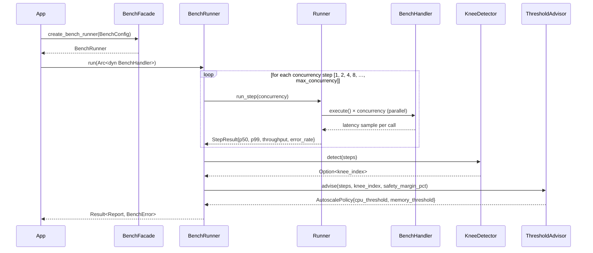
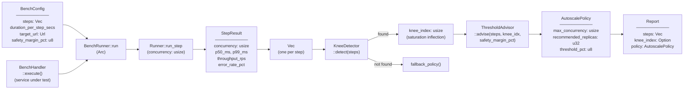

# Architecture — edge-autoscale

## Sequence

> `BenchRunner` drives concurrency ramp-up, collecting `StepResult` at each level; `KneeDetector` finds the saturation inflection point; `ThresholdAdvisor` translates it into HPA thresholds.

## Data Flow

> `BenchConfig` + a `BenchHandler` (the service under test) enter; a `Report` carrying HPA-ready thresholds exits.

